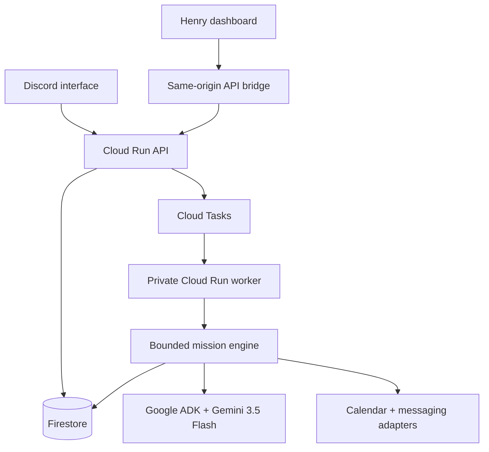

# Henry

**One agent. Multiple interfaces. Persistent workflows. Autonomous execution.**

Henry accepts an outcome, creates a bounded plan, acts in the background, persists every transition, sleeps while waiting, resumes from external events, and interrupts the user only at an explicit authority boundary.

Henry is not a chatbot wrapper. Its primary resource is a durable **mission** with an observable state machine, cost controls, idempotent actions, and a completion contract that requires external read-back evidence.

## The winning mission

> Coordinate a 30-minute project review with A before Thursday. Protect my Tuesday focus block. You may inspect calendars, contact A once, and create a suitable event. Don’t move existing commitments or spend more than $0.10 without asking.

The dashboard lets a judge watch Henry:

1. extract an authority envelope;
2. plan bounded work with Google ADK and Gemini 3.5 Flash;
3. inspect availability and preserve protected commitments;
4. contact the dependency once;
5. persist `WAITING_EXTERNAL` and stop consuming compute;
6. resume from the reply;
7. block the calendar write at `WAITING_APPROVAL`;
8. create the approved event and read it back before declaring success.

## Architecture



The public API and private worker use the same Docker image with different service roles. Cloud Tasks invokes the worker using OIDC. Google ADK and Gemini propose structured plans; the deterministic mission engine owns transitions, limits, retry policy, approvals, and completion verification.

## Reliability and judging proof

| Concern | Evidence |
|---|---|
| Infinite loops | 8-step, 6-model-call, and 12-tool-call caps |
| User authority | Structured allowed, approval-required, and forbidden actions |
| Budget runaway | Per-mission spend cap and `PAUSED_BUDGET` |
| Duplicate delivery | Stable action IDs and processed-task ledger |
| Concurrent workers | Firestore optimistic transactions |
| Long waits | Persisted `WAITING_EXTERNAL`; no minute polling |
| Risky side effects | Calendar creation is blocked behind approval |
| False completion | Event read-back must return `READ_BACK_OK` |
| Tool outage | Bounded retry with visible recovery/failure events |
| Owner control | Durable pause and resume transitions |

## Repository map

```text
app/                 Hosted dashboard and same-origin API bridge
components/          Mission, approval, cost, calendar, and presence surfaces
lib/                 Interactive engine, Cloud adapter, commands, calendar sync
tests/               Frontend behavior and mission-contract tests
cloud-backend/
  henry_cloud/       FastAPI, Google ADK, workflow engine, and cloud adapters
  tests/             State-machine, API, retry, cost, and idempotency tests
  scripts/           Google Cloud provisioning and deployment
  legacy/            Untouched authoritative henry-play5 source
```

## Play locally without credentials

The dashboard defaults to its deterministic interactive engine, so every workflow state is testable before OAuth or Google Cloud setup.

```bash
npm ci
npm run dev
```

Use the test-scenario menu to jump directly to waiting, approval, recovery, budget, and completed states.

## Run the durable backend locally

```bash
cd cloud-backend
python3 -m venv .venv
. .venv/bin/activate
pip install -e '.[dev]'
cp .env.example .env
uvicorn henry_cloud.main:app --reload --port 8080
```

Keep the default demo planner, tools, in-memory repository, and local dispatcher for a credential-free run. In another terminal, point the dashboard bridge at it:

```dotenv
HENRY_CLOUD_API_URL=http://localhost:8080
HENRY_CLOUD_API_KEY=
HENRY_CLOUD_OWNER_ID=dashboard-owner
```

If `HENRY_CLOUD_API_URL` is absent, the dashboard uses the local lab. If Cloud creation is temporarily unavailable, only a new mission falls back safely; an existing Cloud mission never silently forks into local state.

## Test

```bash
npm run lint
npm test

cd cloud-backend
ruff check .
pytest -q
coverage run -m pytest
coverage report
```

Current verified baseline: **25 dashboard tests**, **55 backend tests**, and **99% backend coverage**.

## Deploy to Google Cloud

```bash
cd cloud-backend
./scripts/provision.sh YOUR_PROJECT_ID asia-southeast1
./scripts/deploy.sh YOUR_PROJECT_ID asia-southeast1
```

Production mode uses Firestore, Cloud Tasks, Google ADK, Gemini 3.5 Flash, a public Cloud Run API, and a private Cloud Run worker. Google OAuth and messaging credentials belong in Secret Manager; do not commit token caches or expose the backend API key to browser code.

See [cloud-backend/docs/architecture.md](cloud-backend/docs/architecture.md) for runtime topology and [cloud-backend/docs/legacy-migration.md](cloud-backend/docs/legacy-migration.md) for the boundary between preserved legacy features and the focused Cloud mission slice.

When workflow testing is complete, follow [cloud-backend/docs/google-oauth.md](cloud-backend/docs/google-oauth.md) to connect the real demo Calendar without building unnecessary multi-user account linking.
