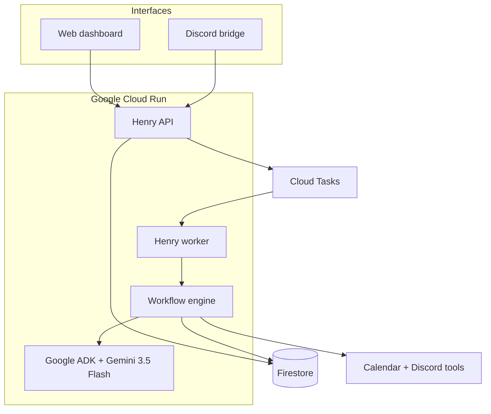

# Henry

**One agent. Multiple interfaces. Persistent workflows. Autonomous execution.**

Henry accepts an outcome, plans bounded work with Google ADK and Gemini 3.5 Flash,
executes actions in the background, persists every transition, sleeps while waiting,
and resumes only when an event or human decision arrives.

This is not a chatbot backend. The primary resource is a **mission** with an observable
state machine and explicit action boundaries.

## Winning demo slice

> Coordinate a 30-minute project review with A next week.

Henry plans the mission, checks Google Calendar, contacts A, enters `WAITING_EXTERNAL`,
resumes when A replies, enters `WAITING_APPROVAL`, and only after approval creates the
event. It then reads that event back before declaring the outcome complete. Every
transition and the mission's structured authority envelope are available to the dashboard API.

## Architecture



The API and worker use the same image but different `HENRY_SERVICE_ROLE` values. The API
is public for the hosted dashboard. The worker is private and invoked by Cloud Tasks with
an OIDC token. This avoids exposing an internal task endpoint on the public service.

## Reliability boundaries

| Concern | Enforcement |
|---|---|
| Infinite agent loops | Eight total steps; six model calls; twelve tool calls |
| Duplicate Cloud Tasks delivery | Stable action IDs and processed task ledger |
| Concurrent workers | Firestore optimistic version transaction |
| External waiting | Persist `WAITING_EXTERNAL`; no polling |
| Side effects | `WAITING_APPROVAL` before calendar creation |
| Budget runaway | Per-mission model-cost ceiling and `PAUSED_BUDGET` |
| Tool outage | Two attempts per step; visible failure event |
| False completion | External read-back must satisfy the completion contract |
| Owner control | Durable `PAUSED` state and explicit resume dispatch |

Defaults are configurable through environment variables, but the caps should remain fixed
for the hackathon demo.

## Repository map

```text
henry_cloud/
  agents/          Google ADK mission planner
  api/             Dashboard, Discord, approval, and worker endpoints
  domain/          Mission, step, event, approval, and usage models
  infrastructure/  Firestore, Cloud Tasks, Calendar, Discord adapters
  ports/           Testable dependency contracts
  services/        Durable workflow state machine
tests/              Transition, retry, idempotency, budget, and safety tests
legacy/             Untouched authoritative henry-play5 source
```

## Run locally

```bash
python -m venv .venv
. .venv/bin/activate
pip install -e '.[dev]'
cp .env.example .env
```

For a deterministic credential-free demo, set:

```dotenv
HENRY_PLANNER=demo
HENRY_TOOL_MODE=demo
HENRY_REPOSITORY=memory
HENRY_DISPATCHER=local
```

Then run:

```bash
uvicorn henry_cloud.main:app --reload --port 8080
pytest -q
coverage run -m pytest
coverage report
```

The suite uses branch-aware coverage and fails below 85%. The verified handoff currently has
55 isolated tests and 99% total coverage. Google services, Discord, OAuth, and time are replaced
with deterministic fakes; no test calls a live account.

Open `http://localhost:8080/docs` for the API contract.

## Dashboard integration

The minimum UI sequence is:

1. `POST /api/v1/missions` with an `outcome`.
2. Poll `GET /api/v1/missions/{id}` while the demo is active, or stream later.
3. Render `steps` as the execution DAG and `GET /events` as the audit trail.
4. Simulate or bridge A's reply through `POST /external-events`.
5. Render pending items from `GET /api/v1/approvals`.
6. Approve through `POST /api/v1/approvals/{id}/decision`.
7. Display `/api/v1/admin/costs` without claiming it includes Cloud billing.

The dashboard should stop polling a mission whenever it reaches a wait or terminal state.

## Google Cloud deployment

The provided scripts create the minimum services and deploy a public API plus private worker:

```bash
./scripts/provision.sh YOUR_PROJECT_ID asia-southeast1
./scripts/deploy.sh YOUR_PROJECT_ID asia-southeast1
```

Production settings:

```dotenv
HENRY_PLANNER=adk
HENRY_MODEL=gemini-3.5-flash
HENRY_REPOSITORY=firestore
HENRY_DISPATCHER=cloud_tasks
HENRY_TOOL_MODE=live
```

Store the Google OAuth token JSON and Discord bot token in Secret Manager; do not commit
OAuth cache files. The deploy script starts in deterministic tool mode so deployment can be
verified before secrets are connected. Switch `HENRY_TOOL_MODE=live` only after both secrets
and `HENRY_CONTACTS_JSON` are configured.

For the exact Google consent-screen, local bootstrap, and Secret Manager commands, see
[docs/google-oauth.md](docs/google-oauth.md).

## Legacy strategy

`legacy/henry-play5.py` is preserved byte-for-byte. It remains the reference implementation
for personality, Discord behavior, reminders, notes, goals, Spotify, Gmail, Calendar, and
SQLite memory. The Cloud slice ports only the Calendar/Discord path required by the winning
mission. No working legacy feature was redesigned.

See [docs/legacy-migration.md](docs/legacy-migration.md) for the boundary between preserved,
ported, and deferred capabilities.
