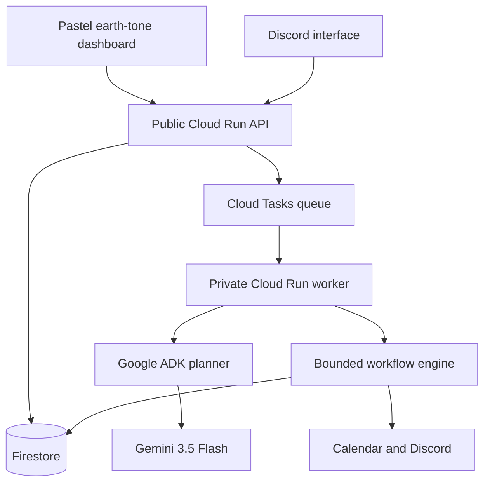
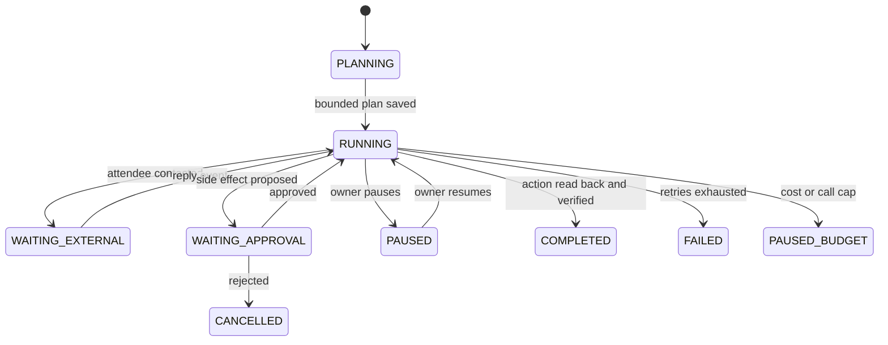

# Henry Cloud architecture

## Runtime topology

## Mission state machine

## Ownership

| Component | Owns | Does not own |
|---|---|---|
| Google ADK + Gemini | Small structured mission plan | Durable state or retry policy |
| Workflow engine | Transitions, limits, approval rules | Provider-specific persistence |
| Firestore | Missions, events, approvals, versions | Execution scheduling |
| Cloud Tasks | At-least-once wakeups | Mission truth |
| Tool adapters | Idempotent external actions | Planning or policy |
| Dashboard / Discord | Outcome delegation and decisions | Background execution |
